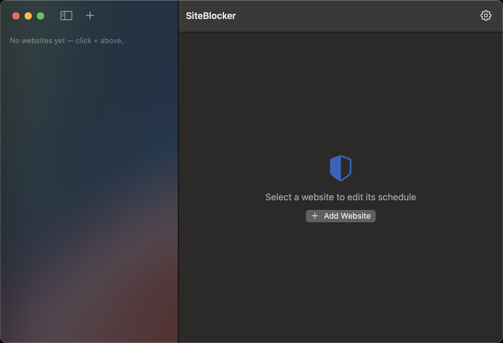
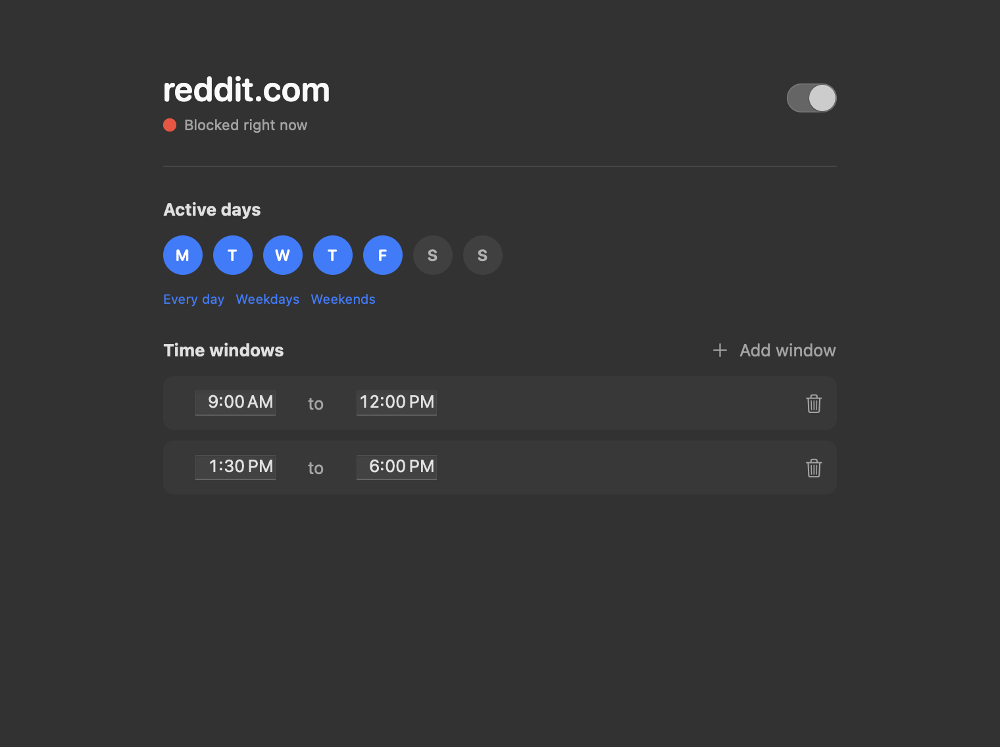

<div align="center">

# SiteBlocker

**一个原生 macOS 应用，按计划屏蔽分心网站 —— 在后台强制执行，关掉软件也照样生效。**

[English](README.md) · [中文](README.zh-CN.md)

[](https://github.com/freeyy/SiteBlocker/actions/workflows/ci.yml)




</div>

SiteBlocker 帮你保持专注：按你设定的计划屏蔽分心网站 —— 比如在工作时间屏蔽社交媒体和新闻。和浏览器
插件不同（一时心软就能关掉），它的屏蔽由系统级的守护进程强制执行，关掉软件也解除不了。

**怎么用：** 添加你想屏蔽的网站，为每个网站选好星期和时段，再安装一次守护进程。之后屏蔽就会自动进行 —— 重启也照样生效。

## 功能特性

- 🗓️ **按网站设定计划** —— 按时段和星期几屏蔽（支持多个时段、跨午夜）。
- 🛡️ **后台强制执行** —— 一次性安装的守护进程，在你退出软件或重启后依然持续屏蔽。
- ⚡ **实时生效** —— 改动会在几秒内同步到 `/etc/hosts`。
- 🔒 **屏蔽 Secure DNS (DoH)** —— 可选，阻止浏览器通过 DNS-over-HTTPS 绕过屏蔽。
- 🪶 **占用极低** —— 守护进程「跑完即退」，平时不驻留，内存接近零。
- ✨ **极简原生 SwiftUI** —— 干净的双栏界面，唯一需要配置的就是你的网站。

<p align="center"></p>

## 工作原理

SiteBlocker 通过往 `/etc/hosts` 写入 `127.0.0.1 <域名>` 来屏蔽网站。写这个文件需要 root 权限，所以
由一个轻量的**守护进程**来执行 —— 它只需用密码安装一次。它会按时应用你的计划、
被篡改后自动恢复、通过 `launchd` 的 `WatchPaths` 实时同步你的改动、开机自启，并且每次只运行一瞬间。
图形界面只负责编辑一个 JSON 配置 —— 关掉它，屏蔽照样工作。

| 组件 | 职责 |
|---|---|
| `SiteBlockerCore` | 纯逻辑、全测试覆盖：计划判定、hosts 生成、配置 |
| `site-blocker-helper` | 守护进程调用的 root 工具，负责同步 `/etc/hosts` |
| `SiteBlocker.app` | SwiftUI 图形界面 |
| LaunchDaemon | 在登录时、按短间隔、以及配置一改动就立刻运行 helper |

每个网站的状态读取**真实的 `/etc/hosts`**，所以即使软件关着期间文件被改过，状态也如实反映：
🔴 正在屏蔽 · 🟠 已计划但尚未强制执行 · ⚪️ 空闲 · 暗色 = 已禁用。

## 安装

1. 从 [最新 release](../../releases/latest) 下载 `SiteBlocker.app.zip`，解压后拖到**应用程序**文件夹。
2. 应用未经过公证，首次打开需**右键 → 打开**（或执行
   `xattr -dr com.apple.quarantine /Applications/SiteBlocker.app`）。
3. 点右上角**齿轮** → **Install helper**，输入一次管理员密码。
4. 点 **+** 添加网站，设置星期和时段即可。

## 从源码构建

需要 macOS 13+ 和 Swift 6 工具链（Xcode **Command Line Tools** 即可，无需完整 Xcode）。

```sh
make check   # 运行全部测试（单元 + 集成）
make app     # 构建并打包 build/SiteBlocker.app
make run     # 构建、打包并启动
```

完整的行为清单见 [`docs/USER_STORIES.md`](docs/USER_STORIES.md)。

## 许可证

[MIT](LICENSE) © freeyy
